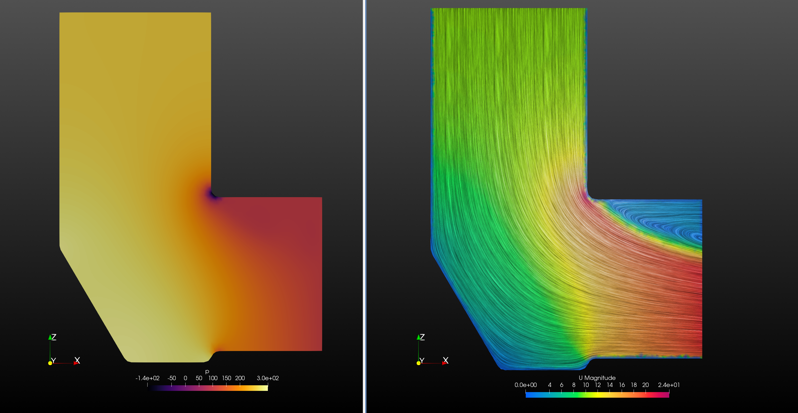

# Lid-Driven Cavity

The unsteady incompressible lid-driven cavity problem programmed in C++ using a projection scheme

# Inlet Box

This simulation was run in OpenFOAM with a tetrahedral mesh (~300k elements).  
Below are streamline (left) and pressure (right) visualizations:

