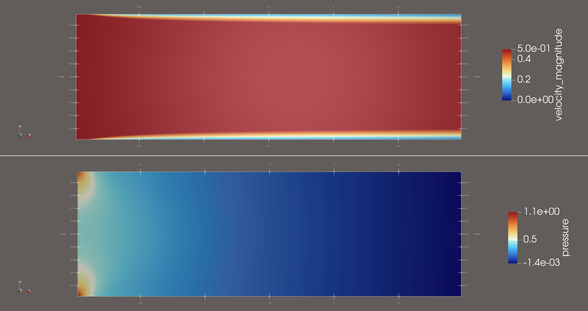

# CFD Mini-Portfolio — C++ & OpenFOAM
[]()
[]()
[]()

High-fidelity toy solvers + industrial cases: clean numerics, reproducible setups, and crisp visuals.

<p align="center">
  
  
  
</p>

---

## Contents
- [Lid-Driven Cavity (C++, Projection)](#lid-driven-cavity-c-projection)
- [Channel Flow (C++, Projection)](#channel-flow-c-projection)
- [Rayleigh–Bénard Convection](#rayleigh–bénard-convection)
- [Inlet Box (OpenFOAM)](#inlet-box-openfoam)
- [Run It / Reproducibility](#run-it--reproducibility)
- [Tech Stack](#tech-stack)
- [References](#references)

---

## Lid-Driven Cavity (C++, Projection)
2D unsteady incompressible cavity; projection method; centerline validation vs. Ghia et al.

<p align="center">
  
</p>

<details>
<summary><b>Details</b></summary>

- **Discretization**: FDM on a uniform grid, 2nd-order central; projection step via Poisson solve.
- **BCs**: No-slip walls; moving lid.
- **Outputs**: centerline profiles, residual logs, PNG frames.
- **Todo**: switch to multigrid Poisson, add Re=1000 stability notes.

</details>

---

## Channel Flow (C++, Projection)
2D channel; start-up transient to fully developed profile; compares with analytic Poiseuille.

<p align="center">
  
</p>

<details>
<summary><b>Details</b></summary>

- **Inlet**: fixed U or flow-rate; **Outlet**: ∂/∂x = 0.
- **Validation**: parabolic profile; friction factor vs. Re.
- **Todo**: add periodic domain variant, drag coefficient plot.

</details>

---

## Rayleigh–Bénard Convection
Thermal convection visualizations and diagnostics (FTLE).

<p align="center">
  
  
</p>

<details>
<summary><b>Details</b></summary>

- **Quantities**: temperature, vorticity, streamfunction, **FTLE**.
- **Knobs**: Ra, Pr, grid size.
- **Todo**: Nu vs. Ra plot; spectral vs. FD comparison.

</details>

---

## Inlet Box (OpenFOAM)
Industrial duct elbow; tetra mesh (~300k); streamlines + pressure contours.

<table>
<tr>
<td></td>
<td></td>
</tr>
</table>

<details>
<summary><b>Case Notes</b></summary>

- **Meshing**: SALOME → UNV → `ideasUnvToFoam`; wall y⁺ target; SST k-ω.
- **Solver**: `pimpleFoam`; `adjustTimeStep yes; maxCo 0.7`.
- **Parallel**: `scotch`, `mpirun -np 8`.
- **Todo**: vane param study; Δp vs. flow rate curve.

</details>

---

## Run It / Reproducibility
```bash
# C++ examples (cavity/channel)
mkdir -p build && cd build && cmake .. && make -j
./cavity   --Re 100   --Nx 128 --Ny 128 --dt 1e-3
./channel  --Re 1000  --Nx 256 --Ny 64  --dt 5e-4

# OpenFOAM inlet box (example)
decomposePar -force
mpirun -np 8 pimpleFoam -parallel
reconstructPar -latestTime
